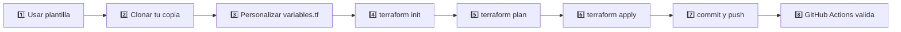

# 🧪 Práctica Guiada: Tu Primer Proyecto con Terraform


Bienvenido/a. Este repositorio es tu **espacio de práctica personal**: aquí vas a crear, versionar y automatizar tu primer recurso de infraestructura con Terraform — **sin necesidad de una cuenta en Azure, AWS ni ninguna otra nube**.

---

## 🗺️ El flujo completo



---

## ✅ Paso 1 — Duplica este repositorio

En la parte superior de **este** repositorio (el original, no tu copia) verás un botón verde **`Use this template`** → **`Create a new repository`**.

- Elige tu propia cuenta como destino.
- Nómbralo, por ejemplo: `terraform-practica-tu-nombre`.
- Puede quedar público o privado, como prefieras.

> **¿Por qué "Use this template" y no "Fork"?** Un fork queda enlazado al repositorio original (útil si vas a proponer cambios de vuelta). Una plantilla crea una copia **100% independiente**, ideal para un ejercicio personal — y además, a diferencia de los forks, **los workflows de GitHub Actions se activan automáticamente**, sin pasos extra.

---

## ✅ Paso 2 — Clona tu copia a tu máquina

Reemplaza `<tu-usuario>` y `<tu-repo>` por los tuyos:

```bash
git clone https://github.com/<tu-usuario>/<tu-repo>.git
cd <tu-repo>
```

---

## ✅ Paso 3 — Personaliza el ejercicio

Abre `variables.tf` y cambia el valor por defecto por tu nombre:

```hcl
variable "participante" {
  description = "Escribe aquí tu nombre para personalizar el ejercicio"
  type        = string
  default     = "Tu nombre aquí"   # 👈 cámbialo
}
```

---

## ✅ Paso 4 — Verifica que tienes Terraform instalado

```bash
terraform version
```

¿No aparece nada? Instálalo primero:

```bash
# Windows
winget install HashiCorp.Terraform

# macOS
brew tap hashicorp/tap && brew install hashicorp/tap/terraform
```

---

## ✅ Paso 5 — Ejecuta el ciclo Terraform

```bash
terraform init      # descarga los proveedores (random y local)
terraform plan       # muestra qué se va a crear, sin tocar nada todavía
terraform apply      # créalo (escribe "yes" cuando te lo pida)
```

Cuando termine, revisa el resultado:

```bash
cat output/bienvenida.txt        # macOS/Linux
type output\bienvenida.txt       # Windows (CMD)
```

Deberías ver un mensaje con tu nombre y un nombre de equipo generado al azar (ej. `curious-falcon`). **Ningún recurso en la nube fue tocado** — todo ocurrió en tu máquina.

---

## ✅ Paso 6 — Sube tus cambios a GitHub

```bash
git add .
git commit -m "Mi primer ejercicio con Terraform"
git push
```

> Nota: `.terraform/`, el archivo de estado (`*.tfstate`) y la carpeta `output/` están en `.gitignore` a propósito. El código de infraestructura se versiona; el **estado** y los **artefactos generados**, no. Es una de las reglas de oro de Terraform.

---

## ✅ Paso 7 — Observa la validación automática

Ve a la pestaña **`Actions`** de tu repositorio en GitHub. Verás un workflow ejecutándose que corre `fmt`, `init`, `validate` y `plan` automáticamente — la misma verificación que correría un equipo real antes de fusionar un cambio a producción.

Este workflow **solo hace `plan`**, nunca `apply`: es seguro por diseño, no puede crear ni borrar nada por sí solo.

---

## 🎯 ¿Qué acabas de practicar?

- El ciclo central de Terraform: `init → plan → apply`.
- Uso de variables (`variables.tf`) y salidas (`outputs.tf`).
- Dependencias implícitas entre recursos (`local_file` usa el valor de `random_pet`).
- Buenas prácticas de control de versiones con `.gitignore`.
- Un pipeline de validación continua con GitHub Actions.

---

## 🆘 Preguntas frecuentes

**"`terraform: command not found`"**
Terraform no está instalado o no está en el PATH. Revisa el Paso 4.

**`terraform init` falla con un error de red**
Necesitas conexión a internet: descarga los proveedores desde `registry.terraform.io`, aunque el ejercicio no use ninguna nube.

**No veo la pestaña Actions ejecutándose**
Confirma que la carpeta se llama exactamente `.github/workflows/` (con el punto inicial) y que usaste "Use this template", no una descarga de ZIP.

---

## 📁 Estructura de este repositorio

```
.
├── main.tf                      # Recursos: random_pet + local_file
├── variables.tf                 # Variable "participante"
├── outputs.tf                   # Salidas del ejercicio
├── .gitignore                   # Excluye estado y artefactos generados
└── .github/workflows/
    └── terraform.yml            # Validación automática (fmt, init, validate, plan)
```
